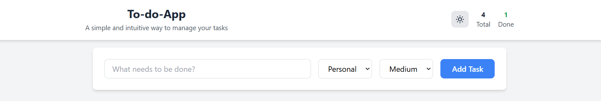
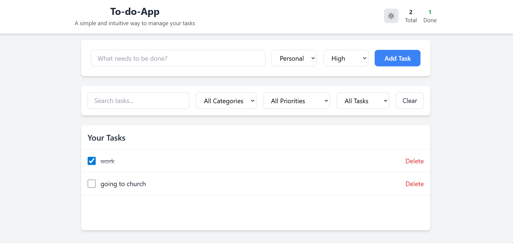
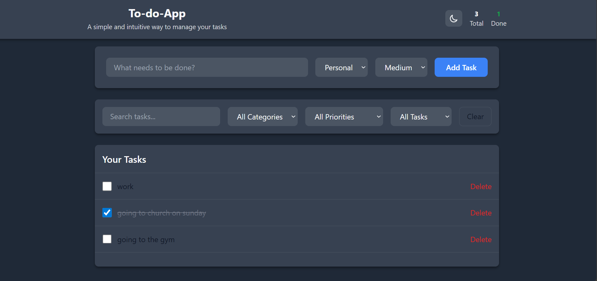
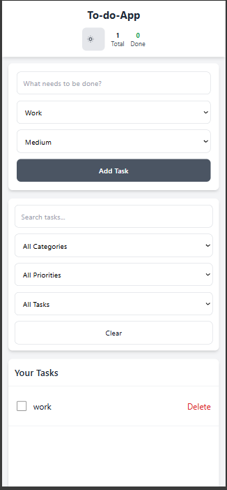
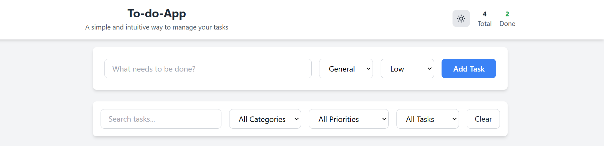

# To-do-App

A beginner-friendly todo list application for managing daily tasks with categories, priorities, and dark mode support.

## Features

### Core Features
- ✅ Add new tasks with categories and priorities
- ✅ Mark tasks as complete/incomplete
- ✅ Delete unwanted tasks
- ✅ Persistent storage using LocalStorage

### Additional Features
- 🌙 Dark mode toggle with preference saving
- 📱 Fully responsive design (mobile, tablet, desktop)
- 🔍 Search tasks by text
- 📂 Task categorization (General, Work, Personal)
- ⚡ Priority levels (High, Medium, Low) with color coding
- ✏️ Inline task editing (double-click to edit)
- 📊 Task statistics display

## Technologies Used

- **HTML5** - Semantic markup and structure
- **Tailwind CSS** - Modern utility-first CSS framework
- **JavaScript** - Interactive functionality and DOM manipulation
- **LocalStorage** - Client-side data persistence

## Folder Structure

\`\`\`
/todo-app
├──/assets/
|   ├──index.css/       # Custom CSS styles
|   ├──index.js/        # JavaScript functionality
|   ├──images/
├── index.html          # Main HTML file
└── README.md           # Project documentation
\`\`\`

## Setup Instructions

1. **Clone or Download**: Get the project files to your local machine
2. **Open Project**: Navigate to the project folder
3. **Launch App**: Open `index.html` in any modern web browser
4. **Start Using**: Begin adding and managing your tasks!

No additional setup, dependencies, or build process required.

## Usage Guide

### Adding Tasks
1. Type your task in the "What needs to be done?" input field
2. Select a category (General, Work, Personal)
3. Choose priority level (High, Medium, Low)
4. Click "Add Task" button

### Managing Tasks
- **Complete Task**: Click the checkbox next to any task
- **Edit Task**: Double-click on the task text to edit inline
- **Delete Task**: Click the "Delete" button next to any task
- **Search Tasks**: Use the search box to find specific tasks

### Using Filters
- **Category Filter**: Filter tasks by General, Work, or Personal
- **Priority Filter**: Show only High, Medium, or Low priority tasks
- **Status Filter**: View All, Pending, or Completed tasks
- **Clear Filters**: Reset all filters to show all tasks

### Dark Mode
- Click the sun/moon icon in the header to toggle dark mode
- Your preference is automatically saved for future visits

## Screenshots

## Key UI sections to capture:

- Main interface with task list
 

- Add task form with categories and priorities

- Dark mode view

- Mobile responsive layout

- Filter and search functionality

---

---
## Deployment
deployed link
[
    https://ualine055.github.io/to-do-app/
    
]
## how to run locally
clone the repository:
[
git clone https://github.com/Ualine055/to-do-app.git
]

